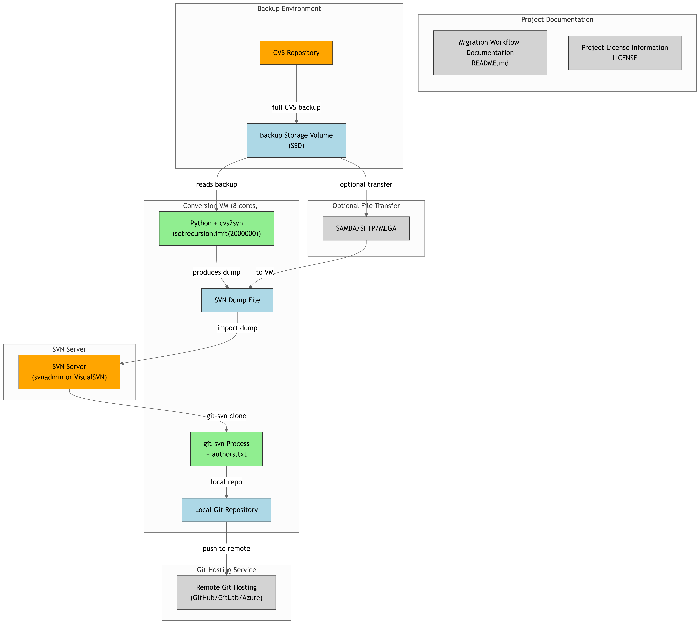

# CVS-to-GIT

----------- Pre-requisites before to initial process conversion -------------

1. Backup full of CVS repository
2. Upload or copy file backup to machine below
3. Machine with reccommendations:
   - Recommended 8 Core processor
   - Recommended 24 GB Memory RAM
   - 1 Disk SSD M2.NVME or UltraSSD provide for Microsoft Azure (Used this scenario UltraSSD Disk provide by VM Azure)
   - 1 Disk only for backup other files
   - Install python, git, svn, cvs and cvs2svn

------------------------------------------------------------------------------------------------------------

Process conversion of repository CVS to GIT


---------------------------- First step to migration CVS to GIT ---------------------------------------------

1º step - Python Configuration

Install python in your distro.

```
sudo apt-get update
sudo apt-get install python3.6
```

Before start process conversion, open the file python below and insert parameters about threads processing also procedure have performed in repository CVS with more than 12 years data and much more than five hundred thousand commits for processing.

```vim /usr/lib/python2.7/dist-packages/cvs2svn_lib/changeset.py```

```
import sys<br>
sys.setrecursionlimit(2000000) 
```
Save and exit file.

------------------------------------------------------------------------------------------------------------

2º step - Perfom conversion full repository full CVS to SVN in a dump file.

In your distro Linux, execute this command:

```cvs2svn  --encoding=ascii --encoding=utf8 --encoding=utf16 --encoding=latin --dumpfile=/mnt/n/cvs2/project-repo.dump --trunk=project-repo/trunk --branches=project-repo/tags  /mnt/n/cvs2/Backup-CVS/Data/CVS/Repository/project-repo```

In my case, this process duration of 12 hours.

------------------------------------------------------------------------------------------------------------

3º step Import File Dump  CVS - Windows or Linux

(VM Windows)
- Import dump file in VisualSVN to review and validate data of repository in the dump. To import file dump VM Linux to Windows, use SAMBA, or a tool of transfer files, FTP, SFTP or any service of cloud transfer files between VMs. In this case I perform the transfer, configuring a machine Linux in a server file of service MEGA with RSA4096 bits. The procedure to accomplish this, its found here in my repo portfolio.

Install the VisualSVN, open the program and select in the top menu -> ```New -> Import Repository.```

After this, select the file dump and wait for the import process to finish.

|

(VM Linux)
- Before to execute this, need install SVN Server. See my repo https://github.com/duarpadev/install-svn. After installation, execute this steps below.

```
svnadmin create /var/www/svn/
mkidr -p /var/www/svn/projects/folder
chown -R /var/www/svn/projects/folder
svn mkdir file:///var/www/svn/folder/projects -m "Add projects repository"
svn mkdir file:///var/www/svn/folder/projects/head -m "Add head at repository projects"
svn mkdir file:///var/www/svn/folder/projects/branches -m "Add branches at projects repository"
svn mkdir file:///var/www/svn/folder/projects/tags -m "Add branches at projects repository"
svnadmin load /var/www/svn/folder/projects < projects.dump
```

------------------------------------------------------------------------------------------------------------

4° step - Execute GIT-SVN to convert SVN to GIT

In the servidor where is installed and configured SVN, GIT, perform command below to generate file authors.txt. This command have perform inside repository SVN in the Linux.

1º option of command:

```svn log | grep '^r[0-9]' | awk '{print $3}' | sort | uniq ```

or 


2º option of command:

```svn log -q /opt/svn/svn-win/trunk | awk -F '|' '/^r/ {sub("^ ", "", $2); sub(" $", "", $2); print $2" = "$2" <"$2">"}' | sort -u > /home/path/your_folder/authors.txt```

or


3º option of command:

```svn log -q https://url-your-svnrepo/svn/project-repo/trunk | awk -F '|' '/^r/ {sub("^ ", "", $2); sub(" $", "", $2); print $2" = "$2" <"$2">"}' | sort -u > /home/path/your_folder/authors.txt```

--

This get list, the display of items that confirmed, filter lines that initial with a revision, number, author, date, list and delete duplicates lines.
 ( r[12345] | author | date-and-stuff...), print (autor), list and delete duplicates lines. )

------------------------------------------------------------------------------------------------------------

5º step - Perform migration to GIT without file authors.txt (Not recommend! Execute only for purposes test)

In Windows, execute:

```git svn clone https://url-your-repo/svn/project-repo/ "C:\git\projects-repo" -s --no-metadata```


<br>Notice: The command have request credencials acess at SVN that has configured in installation VisualSVN.</br>

-> Perform migration to GIT with file authors.txt</br>

```git svn clone https://url-your-repo/svn/project-repo/ "C:\git\projects2" -s --no-metadata --authors-file="authors.txt"```

Or working on Linux, see command below. (I recommend this command)

```git svn clone -r1:HEAD --no-minimize-url --stdlayout --no-metadata --authors-file /home/folder/folder-b/authors.txt https://url-your-repo/svn/project-repo/```

------------------------------------------------------------------------------------------------------------

6º step - Converting tags SVN to tags GIT

Access directory of repository converted and execute the following commands.

Convert weird tag branches to real git tags:
```
cd projects
cp -Rf .git/refs/remotes/tags/* .git/refs/tag s/
rm -Rf .git/refs/remotes/tags
```

------------------------------------------------------------------------------------------------------------

7º step - Converting branches SVN to branches GIT

Convert old svn branches to real git branches:
```
#cp -Rf .git/refs/remotes/* .git/refs/heads/
cp -Rf refs/remotes/* /ssd/projects/.git/refs/heads/
rm -Rf .git/refs/remotes
```

------------------------------------------------------------------------------------------------------------

8º step - Create new repository GIT to hosting in GitHub


Method 1

Add URL new GitHub repo in your repo!

```
git remote add origin https://url/repositorio.git
```

Send all reposirtoy with tags and branches...

```
git push origin –-all
git push -u origin master
```

Notice: If prompt credentials, enter with credentials of your service Git (eg. GitHub, GitLab, Gitea, Git Azure Repo, etc.)

|

Method 2 --> Recommend

```
cd /git/project.git
git remote add origin http://gitlab.yourcompany.com/namespace/git_repo_name.git
git config --global user.email "user@yourcompany.com"
git config --global user.name "User Name"
git add --all
git commit -m "Convert CVS to Git"
git push origin master
```

## Solution



